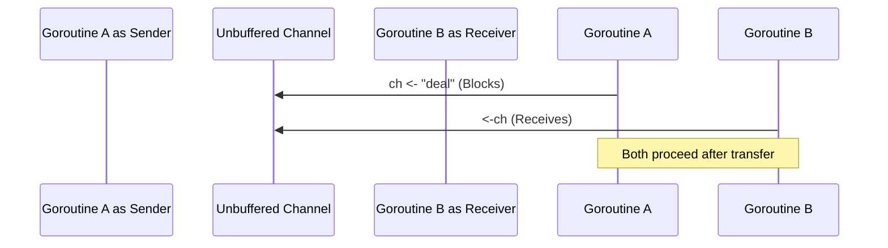
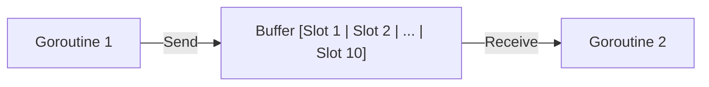

# Go Channels

## What is a Channel?

A **channel** is a typed conduit through which concurrent goroutines communicate and synchronize by sending and receiving values.

Go's fundamental concurrency philosophy is:

> *"Do not communicate by sharing memory; instead, share memory by communicating."*

Instead of having multiple goroutines access the same shared memory using locks (mutexes), channels allow goroutines to pass messages back and forth safely without explicit locks.

---

## Creating and Using Channels

Channels are created using the built-in `make` function:

```go
ch := make(chan string) // unbuffered channel of strings
```

### Channel Operations

The channel operator is `<-`:

| Operation | Syntax | Description |
|---|---|---|
| **Send** | `ch <- "hello"` | Sends `"hello"` into channel `ch` |
| **Receive** | `msg := <-ch` | Receives a value from `ch` and assigns it to `msg` |
| **Receive and discard** | `<-ch` | Waits for a value from `ch` and discards it |

---

## Unbuffered Channels vs Buffered Channels

Understanding the difference between unbuffered and buffered channels is essential in Go.

### 1. Unbuffered Channels (Synchronous)

Created without a capacity parameter:

```go
ch := make(chan string) // capacity = 0
```

- **Synchronous handshake**: A send blocks until another goroutine is ready to receive. A receive blocks until another goroutine sends.
- Neither goroutine can proceed until both are ready at the channel.



> [!WARNING]
> If you try to send to or receive from an unbuffered channel in the same goroutine without another goroutine running to receive/send, Go will panic with:
> `fatal error: all goroutines are asleep - deadlock!`

### 2. Buffered Channels (Asynchronous)

Created with a specified capacity:

```go
laptopChannel := make(chan string, 10) // capacity = 10
```

- **Asynchronous up to capacity**:
  - Sends do **not block** as long as there is space in the buffer.
  - Sends only block when the buffer is full.
  - Receives only block when the buffer is empty.



---

## Example Walkthrough: `tutorial_9`

In `tutorial_9`, we search for the cheapest laptop deal across multiple retail websites concurrently:

```go
package main

import (
    "fmt"
    "math/rand"
    "time"
)

var MAX_LAPTOP_PRICE float32 = 979

func main() {
    // Buffered channel with capacity 10
    laptopChannel := make(chan string, 10)
    websites := []string{"amazon", "bestbuy", "tokopedia", "shopee", "lazada"}

    for i := range websites {
        // Launch a goroutine for each website
        go getLaptopPrice(websites[i], laptopChannel)
    }

    // Receive the winning deal from whichever site responds first
    sendMessage(laptopChannel)
}

func getLaptopPrice(website string, laptopChannel chan string) {
    for {
        time.Sleep(time.Second * 1)
        laptopPrice := rand.Float32() * 20
        if laptopPrice < MAX_LAPTOP_PRICE {
            laptopChannel <- website // Send result to channel
            break
        }
    }
}

func sendMessage(laptopChannel chan string) {
    fmt.Println("The deal is on website:", <-laptopChannel)
}
```

### Why a buffered channel is useful here

1. Multiple sites will find matching prices and want to send their site names into `laptopChannel`.
2. `sendMessage` only reads the first deal (`<-laptopChannel`).
3. If `laptopChannel` were unbuffered, any subsequent website goroutine trying to send `laptopChannel <- website` would block forever in memory because nobody is reading from the channel anymore (a **goroutine leak**).
4. With a buffered channel (`make(chan string, 10)`), the remaining goroutines can drop their values into the buffer and exit cleanly without getting stuck.

---

## Channel Direction (Send-Only and Receive-Only)

When passing channels into functions, you can restrict their direction for type safety:

```go
// Send-only channel: can only send to ch
func produce(ch chan<- string) {
    ch <- "data"
}

// Receive-only channel: can only read from ch
func consume(ch <-chan string) {
    msg := <-ch
    fmt.Println(msg)
}

// Bidirectional channel: can both send and receive
func normal(ch chan string) {
    // ...
}
```

This prevents accidental reads in sender functions and accidental writes in receiver functions at compile time.

---

## Closing Channels and `range`

A sender can close a channel to notify receivers that no more values will be sent:

```go
close(ch)
```

### Testing if a channel is closed

Receiving from a channel returns a second boolean value indicating whether the channel is still open:

```go
val, ok := <-ch
if !ok {
    fmt.Println("Channel is closed, no more values!")
}
```

### Reading with `for range`

You can loop over values from a channel until it is closed:

```go
func main() {
    ch := make(chan int, 3)
    ch <- 1
    ch <- 2
    ch <- 3
    close(ch) // Must close so range loop terminates!

    for val := range ch {
        fmt.Println(val)
    }
}
```

> [!IMPORTANT]
> - Only the **sender** should close the channel, never the receiver.
> - Sending to a closed channel causes a **panic**!
> - Closing an already closed channel causes a **panic**!
> - You do not always need to close every channel; only close when the receiver needs to know that no more data is coming (such as to terminate a `range` loop).

---

## The `select` Statement

The `select` statement lets a goroutine wait on multiple channel operations simultaneously. It executes whichever case is ready first:

```go
select {
case msg1 := <-chan1:
    fmt.Println("Received from chan1:", msg1)
case msg2 := <-chan2:
    fmt.Println("Received from chan2:", msg2)
case <-time.After(3 * time.Second):
    fmt.Println("Timeout! No channel responded in 3 seconds.")
default:
    fmt.Println("No channel was ready, moving on without blocking.")
}
```

---

## Mutex vs Channels: When to use which?

| Use Case | Recommended Tool | Why |
|---|---|---|
| Passing ownership of data | **Channel** | Clean message-passing, avoids shared state |
| Distributing tasks to workers | **Channel** | Easy task queue implementation |
| Coordinating / signaling events | **Channel** | Done signals, timeouts, cancelation |
| Caching or mutating shared state | **Mutex** | Simple, fast in-memory locking (`sync.Mutex`, `sync.RWMutex`) |
| Fine-grained field-level protection | **Mutex** | Protects specific struct fields with minimal overhead |

---

## Summary

- Use `make(chan T)` for unbuffered channels (synchronous coordination).
- Use `make(chan T, size)` for buffered channels (asynchronous message queuing).
- Send with `ch <- val`, receive with `val := <-ch`.
- Close channels with `close(ch)` when the sender is done.
- Use `select` to handle multiple channels or implement timeouts.
- Use directional types (`chan<- T`, `<-chan T`) to enforce safe API boundaries.

---

## Related Notes

- [Go Basic Knowledge Guide](./golang-basics.md)
- [Go Goroutines and Mutex](./golang-goroutines-and-mutex.md)
- [Go Generics](./golang-generics.md)
- [Go Structs and Interfaces](./golang-structs-and-interfaces.md)
- [Go File Structure and Scope](./golang-structure-and-scope.md)
